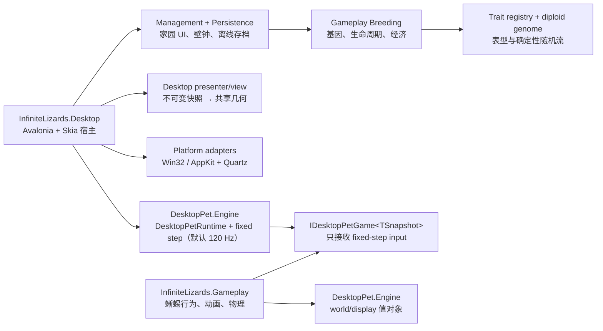

# Infinite Lizards 架构

当前实现把“通用桌面宠物引擎”、“蜥蜴 gameplay”和“平台窗口/渲染”拆成独立项目。新的跨平台入口是 `src/InfiniteLizards.Desktop`；根目录的 `DesktopLizard.csproj` 仍是上游 WPF/Windows 入口，用于回归和迁移期对照。

## 物理分层

| 项目 | 拥有的职责 | 禁止依赖 |
|---|---|---|
| `DesktopPet.Engine` | `DesktopPetRuntime<TSnapshot>`、`IDesktopPetGame<TSnapshot>`、固定步进、逐屏 96-DIP 映射、有状态坐标帧切换、窗口放置值对象与插件边界校验 | Avalonia、Win32/AppKit、蜥蜴状态机 |
| `InfiniteLizards.Gameplay` | 配置/Profile、行为 FSM、步态/IK、悬挂物理，以不可变 `LizardRenderFrame` 输出；另拥有 trait registry、双等位基因、表型、繁育/生命周期/经济 aggregate | 窗口、显示帧 delta、DPI、壁钟、磁盘、鼠标 API、平台 P/Invoke |
| `InfiniteLizards.Desktop` | composition root、显示帧采样、全局指针、点击穿透、窗口放置、Avalonia/Skia presenter/view；家园管理 UI、壁钟推进和 `breeding-world.json` 原子持久化 | 不得拥有 fixed-step 累积器，不得实现 gameplay 状态转移、遗传/经济规则和动画公式 |

`LizardGameModule` 是蜥蜴 gameplay 对通用 Engine port 的实现。Desktop composition root 创建 game、`DesktopPetRuntime<LizardRenderFrame>` 与 presenter；`PetWindow<TSnapshot>` 持有 runtime 和 presenter，不持有原始 game port，也不能访问 `BehaviorController` 或物理内部状态。

调试功能也遵守该边界：Gameplay 只通过 `ILizardPortableDebugBridge` 输出不可变的状态/骨架 DTO 与显式动作命令；FPS、指针、DPI、窗口跟随和轨迹队列仍由 Desktop 拥有。Windows WPF 与跨平台 Avalonia 面板因此可以呈现同一语义，而不会把显示帧或平台对象重新塞回 gameplay。

失手回抓同样不泄漏到平台层：行为 FSM 仍只有 `Falling → Regripping`，并输出 `LostGripReachProgress` 与 `ReachedTarget / SafetyForced` 转换原因；`DanglingRig2D` 在自由落体粒子约束内为四条肢体分别计算抓点与 IK，`RegripPoseController` 以四位接触掩码原子管理表现层的 `Seeking → ContactHold → Recovering`。每条肢体默认锁定捕获时的 IK 弯曲支路，仅允许在接近完全伸直且相邻肘部连续时切换一次；切换后的中段若需要避开躯干，可使用逐步有界的安全投影，不能靠回滚停住脚掌。只有四足路径、终点和当前姿态都通过安全契约，并且四足都到达各自目标，最终移动子步才原子提交接触；下一静止子步保持抓点并恢复。Windows/macOS renderer 只消费同一份 `LizardRenderFrame`，不各自实现伸手动画。

领域源码也遵守同一边界：蜥蜴 `Core` 和 gameplay `Application` 文件只存在并编译于 `src/InfiniteLizards.Gameplay`。旧 WPF 宿主通过 `ProjectReference` 消费该程序集，不再编译第二份领域类型；架构测试会拒绝 Gameplay 项目的任何外部 `Compile` glob 或 WPF 源码重复。

## 繁育领域、时钟与事务边界

透明桌宠模拟和家园繁育是两条独立时间线：

- 桌宠仍由 Engine 的固定步进独占推进，消费 world-space 指针和工作区输入。
- `BreedingSimulation` 只接受调用者显式传入的 `TimeSpan`，不读取壁钟、显示帧、DPI 或窗口。它持有金币、可繁育地点、蜥蜴、蛋和确定性随机状态，并输出不可变 snapshot/action result。
- Desktop 的 `GameManagerWindow` 以一秒计时器把实际经过时间交给 `LizardBreedingManagementSource`；`BreedingWorldStore` 在加载时根据 envelope 的 UTC 时间结算最多 30 天离线成长。壁钟只存在于 Desktop 边界。
- 买、卖和繁育都经 application facade 进入领域。管理 source 在内存快照上执行命令后 write-through；存档失败时恢复命令前快照。繁育 UI 的 A/B 槽只选择亲本，提交时先把两只亲本移动到同一个稳定 habitat ID，再执行领域层同地点校验和产蛋。

管理窗口是独立、非模态、非置顶的普通可聚焦窗口，不把透明 `PetWindow` 设为 owner，因此不会与 Win32 `WS_DISABLED`/macOS non-activating surface 的输入所有权冲突。点击桌宠与抓取之间还有一个纯手势仲裁器：4 DIP 以内释放产生详情点击，超过阈值才调用 gameplay `BeginPrimaryInteraction`。

## 遗传注册表与表型边界

`LizardTraitRegistry.Default` 的 `infinite-lizards.genetics.v2` 注册 137 个 descriptor，覆盖 13 类玩家可读维度。每个基因位点保存两份 `[0,1]` allele；子代每个位点分别从两个亲本选择一份，再按 descriptor 独立突变。连续值越界反射、色相环绕并以圆周均值表达，开关翻转，choice 在相邻选项或爆发时全范围跳转。表达前置条件可隐藏但不删除 allele，因此允许隔代返祖。v2 为移除没有安全消费面的 `lifecycle.longevity` 提供 v1 完整 manifest 迁移；保留位点的 allele 逐位不变，已删除位点被明确丢弃。

出生只消费一个根随机值；每个 trait 以稳定 ID 派生自己的 PCG32 子流。新增或重新排序 descriptor 不会改变现有 trait 的创始、遗传或突变结果。快照同时持久化根随机流的 state/increment，恢复后市场 stock、ID、名字和后代序列可以连续复现。

注册表负责“可遗传、可突变、可保存、可在详情读出”，不是自动绘制器。`BreedablePhenotypeCompiler` 把视觉维度编译成有界、renderer-neutral contract；`BreedablePhenotypeProfileResolver` 把体型/步态、速度/加速度、抓附/下落、S 形摆动、休息分布和鼠标反应投射到已验证 runtime profile；纯函数 lifecycle resolver 决定个体冷却、双方共同贡献的孵化速度和幼体成熟速度。`DefaultTraitEffectCoverage.AllPlayerFacing` 必须与默认 registry ID 集合精确相等且无重复，因此未登记消费面的新 trait 会让集合测试失败；登记本身不是效果证明，新 trait 还必须增加对应的 low/high 或 consumer contract 可执行回归，不能只靠详情数字交付。

结构拓扑尤其保持明确边界：方形肖像完整消费 renderer-neutral visual contract，支持 1–5 对腿、每腿 1–5 个可见关节、五类吻部和足型、颈褶/头角/头冠、背鳍/侧鳍/外鳃、趾爪/蹼/吸附垫、可变触须、皮肤质感、尾翼、尾节/柔性/分叉、可变尾刺和尾锤尖刺等组合；每类重复几何都有固定 primitive 上限，并以全低/全高保守 bounds 门禁保证不被方形画布裁切。`ProceduralLizard` 的实时行走、抓取、悬挂和失手回抓仍固定为四支撑腿、两段 IK。composition root 仍只创建一只透明桌宠：有收藏时从持久化的 active genome 构造，选择其他收藏个体则在下次启动生效；这不是多宠物 desktop fleet。完整维度、迁移流程和未实现项见 [BREEDING.md](BREEDING.md)。

## 繁育存档边界

`breeding-world.json` 与有效配置文件同目录，但和 `lizard-settings.json` 使用不同 schema。领域 snapshot 不包含壁钟、UI 图片、DPI 或平台坐标；Desktop envelope 单独记录 `SavedAtUtc` 与下一次启动使用的 active lizard ID。主文件以 `.tmp → 主文件` 替换并保留 `.bak`；主档失败会先严格读取备份，主备都失败才把坏文件改名为 `.invalid-*` 并创建新世界。恢复严格检查 world schema、registry ID、规则、经济、ID、随机状态、唯一实体 ID、时间范围和每个 genome；任何兼容 registry 升级都必须由精确 predecessor manifest 授权，不能悄悄忽略未显式声明的位点。

详情 UI 通过 application facade 枚举 registry 的全部 trait，并使用基因哈希作为稳定 portrait key。实际方形肖像由 phenotype 数据现场绘制；孵化室另以 `EggPortraitView` 消费子代 `EggAppearance` 的蛋壳色相和六类花纹，并把孵化进度限制为表现层裂纹/内光。功能按钮消费图片生成模型制作并作为 Avalonia resource 打包的 4×4 atlas，通过 `BreedingIcon` 语义枚举选择单元格，避免 UI 调用处依赖裸索引。

## 固定步进所有权

显示帧和模拟帧是两条边界：

1. Desktop 在每次宿主 tick 生成 `DesktopPetInput`，其中包含显示帧 delta、当前 world 导航/安全区和指针状态。
2. Engine-owned `DesktopPetRuntime` 缓存构造时验证过的 metrics/timing，用 `FixedStepRunner` 累积显示时间并切成完整的 `DesktopPetFixedStepInput`。默认 profile 为 `1/120 s`，过大 display delta 按 `MaximumFrameCatchUp` 有界裁剪。
3. `IDesktopPetGame<TSnapshot>` 只公开 `AdvanceFixedStep`；不存在 raw/display-frame `Advance`。Gameplay 因此看不到渲染刷新率，也不能自行维护第二个帧累积器。
4. Runtime 在每个子步后校验 gameplay 位置/朝向为有限值，只在实际执行了 fixed step 后重新捕获不可变快照；无步显示帧复用上一快照。
5. 抓取、释放、暂停、居中和 rebase 是显式命令。`RebaseWorldPosition(delta)` 只平移持久 world 状态，不重置计时、不消费随机数，也不伪装成一次 gameplay `MoveTo`。

这使同一 seed 和录制的 world input 可以在 50–240 Hz 不同显示节奏下得到相同 fixed-step 序列。

根目录旧 WPF 入口所需的显示帧兼容逻辑位于 `Application/LegacyPetSimulationFrameAdapter.cs`，只编入 WPF host 与诊断测试；`InfiniteLizards.Gameplay.dll` 从项目边界上完全看不到该文件。程序集边界测试同时禁止 raw `Advance`、frame input/output 和第二个 `FixedStepRunner` 回流到 Gameplay。

## 96-DIP 逻辑世界契约

Gameplay 每一刻只在一块屏幕的逻辑坐标帧中运行。该坐标帧左上为原点、Y 向下、基于 96-DPI（world/DIP）：一个 world unit 在 Windows 100% 缩放下等于一个设备像素，在 200% 缩放下由两个 backing pixels 栅格化。macOS 的 Avalonia.Native/Screen 坐标是 Cocoa points；`Screen.Scaling` 为 1，真实 Retina backing scale 由 NSWindow 与 Skia 承担。任何 DPI/backing scale 都不能进入行为、物理、步态或随机数输入。

`DisplayTopology` 接收每块屏幕的平台 device/point 坐标 `Bounds`/`WorkingArea` 和 `Scale`，为每块屏幕建立独立的 96-DIP 仿射映射。它保留屏幕排列、负坐标和工作区，但不声称一个无状态、静态的 world 映射能使混合 DPI 接缝上所有点都连续：对同一个原始 Y 坐标分别除以 1x 和 2x，本身就会得到不同 world Y。

`ActiveDisplaySpace` 是解决这个问题的有状态边界：

- 它持有当前屏幕的仿射坐标帧；指针和窗口只在当前帧内做 device↔world 映射。
- 当宠物或拖动指针跨入另一块屏幕时，先把被跟踪 world 位置经旧帧转成 device 位置，再经新帧转回 world；runtime 同步 `RebaseWorldPosition`，宿主同时重建拖动偏移与窗口放置，设备空间的可见位置不跳变。
- 显示器热插拔、缩放或排列改变时，同样经 device space 把持久状态转入替换坐标帧；原屏幕消失时选择主屏，最后收敛到新工作区的完整渲染安全区。
- `SurfacePlacement` 只使用当前屏幕映射；左/上向下取整，右/下向上取整，避免小数缩放时裁掉最外层像素。

因此，相同配置、seed 和 world 输入序列应产生相同的固定步进数、world 轨迹和渲染几何。“一样”指这个确定性契约；不承诺 Windows DWM 与 macOS WindowServer 的色彩管理、抗锯齿和合成像素 bit-identical。

## 共享帧流程

1. Composition root 在首次 `Show` 前调用 `PrepareForShow`：绑定原生窗口边界，读取显示拓扑，以指针所在屏建立 `ActiveDisplaySpace`，重置 runtime/gameplay，并放置首帧窗口。
2. Desktop 以最高 120 Hz 采样显示时间、全局指针和屏幕拓扑，然后把输入交给 Engine runtime。
3. Runtime 执行零个或多个严格 fixed steps，并返回位置、朝向和不可变快照。
4. `LizardView` 从同一份快照生成身体、阴影、四肢、脚、头与眼睛几何；Windows 和 macOS 都由 Avalonia + Skia 绘制。
5. Windows shaped-window 路径在新 pose 提交时先安装“最近已确认姿态 + 全部未确认姿态”的保守并集；Avalonia `CompositionBatch.Rendered` 返回后才允许收窄原生 region。macOS 不创建这条 Windows 专用 fence。
6. 宿主只在平台边界用当前 `ActiveDisplaySpace` 把 world surface 转为平台放置坐标。

## Windows 原生边界

`Win32OverlayWindowBackend` 不参与渲染或 gameplay，只建立 HWND 安全策略：

- Presenter 导出由 Bezier fill/stroke 与 ellipse 组成的不可变可见/输入几何；managed hit test 与 Win32 region 使用同一个 pose。Win32 以目标 DPI 和实测 client insets 把 view DIP 转到 outer-HWND 坐标，用 GDI path/region 构造 `SetWindowRgn`，并做 1 device pixel 抗锯齿安全膨胀。
- `SetWindowRgn` 同时限定 HWND 的可见轮廓和原生命中轮廓。新 pose/version 先把最后一次 compositor-confirmed pose 与所有未确认 pose 做有界并集，绝不让新 region 抢跑裁掉旧 backing；`CompositionBatch.Rendered` 的单调 fence sequence 确认后才退休旧 pose 并收窄。队列上限为 8，合成停滞或原生同步失败时冻结新的视觉提交但固定步模拟继续。
- 每个保留 pose 单独携带它可能出现的 raster scale；跨 DPI 时再保守加入当前/目标 live scale，避免 geometry×历史 scale 的无关笛卡尔积。`RenderScaling` 变化在下一个 Render 前排队同步，乱序确认、同版本不同 scale、fence 失败、capture/reset orphan acknowledgement 和关闭后的晚回调都不得让 region 倒退或失去 fail-closed。
- 点击穿透不通过清空可见 region 实现。`EnableWindow(false)`/`WS_DISABLED` 是独立输入开关：需要交互时仅在 shaped region 已安装后启用 HWND；需要穿透、指针不可用或底层应用正在拖动时禁用 HWND，并保留相同可见轮廓。
- 在首次 `Show` 或 region 失败时，同步安装空 region 并保持禁用/透明 fallback。锁定的 Avalonia 版本正常生命周期不重建 HWND；若已验证后的句柄意外变化，新 HWND 会先进入 fail-closed，随后生产进程 fail-stop，不能带着未重放的 placement/region 继续。
- `WS_DISABLED` 在此窗口上由 overlay backend 独占为穿透开关；不得把 `PetWindow` 用作 modal dialog owner。未来增加模态设置窗时，必须显式仲裁 modal disable ownership，或使用独立 owner。

这些约束已被跨平台可运行的 contract/self-tests 覆盖，但 `SetWindowRgn` 与 DWM 的实际视觉裁切、跨进程点击穿透、混合 DPI/HWND 重建和长期 GDI 句柄仍必须在真实 Windows 机器验证。

`tests/InfiniteLizards.Windows.NativeAcceptance` 有两种严格分开的模式。默认 primitives smoke 用两个独立进程和合成 HWND 验证 USER32/GDI32 基础契约；`--production <InfiniteLizards.Desktop.exe>` 则启动真实发布程序。生产 backend 只有在 nonce、真实父 PID/同 Session 与 route tag 全部有效时，才在实际 Avalonia WndProc 暴露只读计数；完成 `EnsureVisible` 的 region/style/input 验证前不会响应 ready。本轮 nonce 同时派生写入临时配置的高对比身体/瞳孔 marker，DWM 像素 oracle 只接受同一 marker，因此旧保活实例不能替当前 HWND 提供视觉证据。外部控制器仍独立读取窗口 PID、DPI/client、region、DWM screen composite、前台窗口和 GDI/USER 资源，并用 tagged `SendInput` 区分 probe 与真实桌宠的跨进程路由。该遥测不参与正常生产路径，也不绕过原生安全状态机。

生产模式逐屏冷启动，能够证明该机器上的实际发布包、Bezier region builder、render fence 最终输出、DWM 合成和基本点击路由；它不能替代运行中跨屏 `WM_DPICHANGED`、热插拔、右键/拖动/capture 或长期 soak。当前代码仅在 macOS 交叉构建，不能据入口存在宣称 Windows 已 PASS。

## macOS 原生边界

`MacOsOverlayWindowBackend` 保留 Avalonia 的渲染所有权：

- Avalonia 创建的原始 AvnWindow/NSWindow 始终持有 AvnView、content view 和 Skia render target，它是唯一真实的渲染/输入 surface；绝不把 AvnView 搬到自建 panel。
- 额外的透明、non-activating `NSPanel` 不承载内容并始终忽略鼠标，只作为 parent anchor；它声明 `CanJoinAllSpaces`/`FullScreenAuxiliary` 等 collection flags，请求普通桌面 Space 行为，但本轮只验收当前 Space 成员。它固定为目标屏内 1×1，真实 AvnWindow 作为 child 使用动态取得的 status/main-menu overlay level（当前机器读回为 `25`），并随当前屏幕或热插拔重新 anchor；该层级不额外承诺压过其他应用的原生全屏内容。
- 运行时创建零 ivar 的 Objective-C subclass，令真实 surface 的 `canBecomeKeyWindow`/`canBecomeMainWindow` 永远为 false，同时验证实际 class、父子关系、窗口级别、collection behavior 和 getter 状态。
- 生产模式的非激活策略或原生身份不满足时，适配器会锁存 fail-closed，让 surface 保持 `ignoresMouseEvents=true`；不能无声降级成一个可能抢焦点的普通可交互窗口。
- macOS composition root 使用官方 `MacOSPlatformOptions` 设置 `ShowInDock=false` 和 `DisableAvaloniaAppDelegate=true`，避免 Avalonia 11.3.20 默认 AppDelegate 在启动完成时强制激活应用。该 LSUIElement 宿主没有 Dock 重开、Finder 文档/URL 打开契约；菜单退出继续走 `desktop.Shutdown()`。若未来需要这些系统级 delegate 事件，应实现不含强制激活的最小自有 delegate，不得恢复启动抢焦点。
- 每帧保留 Avalonia 托管尺寸/backing 通知，再对 AvnWindow 用一次 `setFrame:display:` 原子更新真实位置和尺寸；销毁时先解除 parent/child，再关闭 anchor，AvnWindow 的 content/render ownership 始终不变。

与当前交付包使用同一原生 runtime 的上一轮 arm64 与 osx-x64/Rosetta 包，已在 Apple Silicon 机器的 screen ID `1/2/4` 通过 native acceptance，三屏 backing scale 分别为 `2/2/1`。验收从 `SurfacePlacement` 进入正式托管放置、Y 转换、screen/anchor 与原子 `setFrame:` 路径，并读回 managed placement、native frame、parent/content、level/collection、非 key/main 状态及当前 Space 公开窗口列表。arm64 受控启动验收中，外部 `NSWorkspace` 221 个约 100 ms 样本与 `lsappinfo` 101 个约 250 ms 样本均始终保持原前台应用，宠物进程从未成为前台；x64/Rosetta 被验轮次在每块屏幕也始终读回原前台 Chrome。解锁后的 WindowServer 实测进一步确认两种架构的主屏 composite 有真实蜥蜴像素，且原生 hit routing 在交互/穿透切换后分别命中 surface/底层窗口。当前 arm64 包已更新 managed assemblies、重新严格签名，并在 2x/1x 外接屏实际运行和目视验收调试侧栏/叠层；完整 production native-acceptance 矩阵尚未重跑。child `isOnActiveSpace` 在跨屏重挂载时可与实际 composite 不一致，因此仅作诊断，不再作 PASS oracle。实体事件投递、其他应用原生全屏以及 Intel 真机仍是补充验收边界。

## 扩展一种新宠物

1. 新建独立 gameplay 项目，只引用 `DesktopPet.Engine`。
2. 定义宠物自己的不可变 `TSnapshot`，并实现 `IDesktopPetGame<TSnapshot>`；只实现 fixed-step 与显式交互/rebase 命令，所有尺寸和位置都使用 world unit。
3. 新建只消费该快照的 presenter/view；view 不反向操作 gameplay，并让可见几何与命中几何来自同一个 pose。
4. 在 Desktop composition root 组装 game + `DesktopPetRuntime` + presenter。只有宠物需要新的原生系统能力时才扩展小型 platform capability 接口。
5. 对同一 seed/world 输入添加无 UI 确定性测试，再补 100%/125%/150%/200% 拓扑与目标系统真机冒烟测试。

## 发布门槛

- 自动基线：Engine、Gameplay、Desktop 和 Windows 原生验收控制器的纯逻辑 self-tests 必须按当次命令输出全部通过；solution Release build 必须为 `0 warning / 0 error`。其中 Gameplay/Desktop 还需覆盖注册表扩展、双等位遗传/突变、生命周期/经济、快照续跑、极端表型、四支撑腿边界、管理事务、点击仲裁和 atlas 资源契约。
- Windows 真机：在解锁且无人操作的混合 DPI 交互桌面依次通过 Win32 primitives smoke 与 `--production ... --require-mixed-dpi`（均不得使用 `--allow-skip`），再补运行中跨屏、热插拔、右键/拖动/capture、HWND rebuild 与长期 GDI/CPU 观察。
- macOS 真机：Retina/非 Retina，内置+外接屏、普通桌面 Spaces、解锁状态下真实点击穿透且应用不激活/不抢焦点；Apple Silicon 与 Intel 分别验证。覆盖其他应用的原生全屏窗口是额外能力，不属于当前原生层级契约。
- 对截图做几何容差比较，而不是跨操作系统逐像素哈希比较。
- macOS 发布必须通过 Hardened Runtime + `allow-jit` 签名验证；Developer ID notarization 需要发布者自己的 Apple 凭据。

具体命令、当前已验证范围和发布步骤见 [CROSS_PLATFORM.md](CROSS_PLATFORM.md)。
