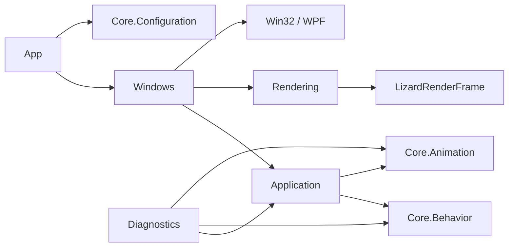
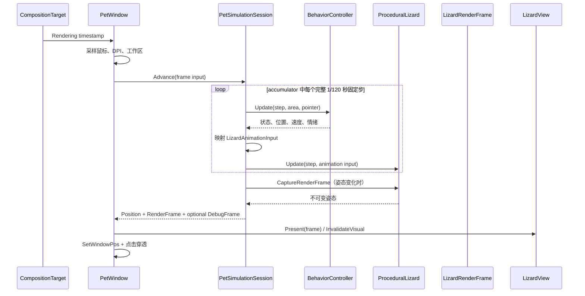
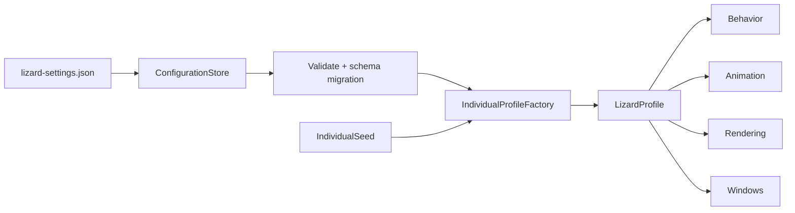

# DesktopLizard 架构说明

本文档描述桌面蜥蜴的模块边界、运行时数据流和后续扩展约束。目标不是把每个状态拆成一个类，而是让行为策略、动画、应用编排、WPF 表现和 Windows 平台代码保持单向依赖。

## 目录与职责

```text
DesktopLizard
├─ Core
│  ├─ Configuration            JSON 模型、校验、迁移和个体 Profile 解析
│  ├─ Behavior                 状态图、自治策略、追鼠、边缘导航、S 弯和失手下坠控制
│  ├─ Animation                动画输入、对角步态、单腿 IK、次级动作和渲染快照
│  ├─ Physics                  悬挂拓扑、粒子约束、抓点材质绑定与姿态校验
│  ├─ BehaviorController*      行为门面及按职责拆分的 partial 编排
│  ├─ ProceduralLizard         程序化姿态门面
│  ├─ DanglingRig2D            悬挂物理生命周期与姿态回写
│  ├─ Chain                    通用链式骨架
│  └─ MathEx                   无平台依赖的数学函数
├─ Application
│  ├─ FixedStepRunner          统一的 120 Hz 子步策略
│  ├─ PetSimulationSession     Behavior → LizardAnimationInput 的唯一映射
│  └─ DebugTelemetryCoordinator 世界遥测到只读调试帧的组装
├─ Rendering
│  ├─ LizardView               只消费 LizardRenderFrame 的 WPF 入口
│  ├─ LizardGeometryBuilder    绘制与命中共用的轮廓构建
│  ├─ DebugOverlayRenderer     关节、目标与路径调试层
│  └─ DebugPanelView           中文关键遥测面板
├─ Windows
│  ├─ PetWindow                帧循环、生命周期和应用装配
│  ├─ PetWindow.Interaction    抓放、菜单和用户命令
│  ├─ PetWindow.Platform       HWND、DPI、穿透和显示器边界
│  ├─ DebugPanelWindow         不遮挡蜥蜴的独立调试侧栏
│  └─ NativeMethods            Win32/DPI/显示器边界
├─ Diagnostics
│  ├─ Framework                统一报告、场景 runner 与流式 probe
│  ├─ DiagnosticCommandRunner  诊断 CLI 的统一入口与报告格式化
│  ├─ *SelfTest                行为、步态、追鼠、抓放、活性回归
│  └─ PreviewExporter          离屏动作预览
├─ Services                    自启动等系统服务
└─ App                         进程生命周期和 composition root
```

## 依赖方向



必须遵守以下边界：

1. `Core` 不引用 WPF、HWND、DPI 或鼠标 API。
2. `Application` 负责把行为输出映射为动画输入；该映射不应再复制到窗口类。
3. `Windows` 只采集平台输入并应用模拟输出，不实现行为或步态公式。
4. `Rendering` 不修改行为状态；调试绘制不能进入命中几何。
5. `Diagnostics` 复用生产 Session、轨迹函数和固定步进策略，不复制近似实现。
6. 所有可调行为/动画/物理/外观参数只从已校验的 `LizardProfile` 注入；模型内部不读 JSON。

## 每帧运行流程



执行顺序是行为稳定性的组成部分：每个子步必须先更新 `BehaviorController`，再更新 `ProceduralLizard`。`FixedStepRunner` 跨显示帧保存不足一个固定步的余量，高刷新率显示器不会把 120 Hz 配置退化为可变小步。抓取期间的窗口位移会一直保留到真正执行固定步，再在该帧的所有子步间按比例分摊。

`PetSimulationSession` 私有持有两个可变模型；窗口只使用命令、只读标量和不可变帧。仅 Diagnostics 能通过明确命名的 `BehaviorForDiagnostics` / `LizardForDiagnostics` seam 进入模型内部，生产窗口不得使用该接缝。

## 行为层

`BehaviorController` 是对外门面，保留世界坐标、当前状态和交互命令；构造时接收一个已解析的个体 Profile。主文件只保留字段、生命周期命令和更新优先级，自治、情绪、状态机、追鼠和边缘反应分别位于 partial/组件文件。可复用规则位于 `Core/Behavior`：

- `RoamingState`：状态、Traits 和合法转移图。
- `AutonomousTransitionPolicy`：接收单个随机样本并返回下一动作，集中校验转移矩阵概率。
- `PointerChaseController`：注意、丢失、冷却和持续追逐的独立生命周期。
- `BoundaryNavigator`：边缘距离、探针和安全转向的纯计算。
- `SCurveMotionController` / `SCurveTrajectory`：多周期 S 弯状态与不消费随机数的轨迹函数。
- `BehaviorController.LostGripFall`：自由落体、基于当前完整渲染安全底边的动态目标、重新抓稳及恢复自主态的完整生命周期。
- `RestDurationDistribution`：30% / 35% / 25% / 10% 长尾休息映射。
- `BehaviorPrimitives`：行为输入和基础值对象。

新增状态时至少需要检查：

1. 状态枚举和合法转移图。
2. `IsLocomoting`、`IsFastCrawl` 等 Traits。
3. 状态入口是否完整初始化自己的计时和运动指令。
4. 鼠标、抓取、暂停、边缘安全的抢占优先级。
5. Debug 中文状态名和对应 SelfTest 覆盖。

随机行为必须保持 `Random.NextDouble()` 的调用次数与顺序。纯策略函数应接收已经生成的 sample，不能在模块内部偷偷增加随机抽样。

`LostGripFall` 是一个显式 FSM 状态，内部只有 `Falling` 与 `Regripping` 两个阶段。五种爬行态可通过 `Choice` 进入，完成后通过 `FallComplete` 进入短暂 `Idle`，再恢复正常自主爬行。真实鼠标抓取和暂停拥有更高优先级；追鼠不能抢占下坠。入口只抽样一次目标距离，下界为配置的 `MinimumDistance`，上界为当前位置到完整渲染安全底边的全部可用距离，不设置固定最大值。`LostGripReachProgress` 在最后 `ReachLeadDistance` 内从 0 增长到 1，但 FSM 仍保持下坠；只有 `LostGripCatchReason.ReachedTarget` 才允许 application seam 在最终移动子步锁存完整伸手输入，下一静止子步进入接触保持。`SafetyForced` 表示动态安全区失效：带位移帧仍以 `FreeFall` 消费位移但沿用更新前的部分进度，随后未完成 IK 的 `Regrip` 必须跳过假接触并走连续释放恢复。配置层要求最短下坠和伸手前导距离在最大落速下都至少覆盖三个固定模拟子步。若底边可用距离不足最小值，当前位置不能满足左、右、上方的完整渲染安全留白，或物理工作区无法完整应用四边留白，入口直接交给 `EdgeTurn`，不允许依靠位置 Clamp 或收缩安全间距掩盖越界。

## 配置与个体层

`LizardConfigurationStore` 是唯一 JSON I/O 边界，负责 schema 迁移、原子写入、坏文件保留和默认回退。配置经过完整校验后，由 `IndividualProfileFactory` 和各 resolver 生成只读 `LizardProfile`：



状态转移矩阵和休息分布都保持显式零权重，并在个体重权后重新归一化。同一配置和 seed 必须生成相同 Profile；个体变化的 RNG 流不得移动行为 FSM 的随机序列。`LizardGeometryEnvelope` 是正常姿态、悬挂/自由落体姿态、窗口画布和桌面导航半径的共同几何边界，任何模块不得复制另一套半径估算。它还计算紧凑正常导航半径与完整渲染窗口半径之差，作为失手下坠的四边安全留白；个体 Profile 改变体型或画布后会同步提升该留白。窗口层从当前物理工作区生成 `LostGripSafetyContext`，只有在四边都能精确应用该留白时才标记为可用；行为层据此确定动态底边上界，不能把不足的工作区静默压缩成“安全”区域。字段说明见 `CONFIGURATION.md`。

## 动画层

动画层维护模型空间中的脊柱、腿、足端和次级动作：

- `LizardAnimationInput` 把完整行为状态收敛为 `Rest / Observe / Locomotion / FastSCurve / Grabbed / FreeFall / Regrip / ReleaseSettle` 八种表现语义；`CatchPreparationProgress` 只在 `FreeFall` 生效，非下坠姿态必须视为 0。
- `LegRig` 独立负责一条腿的两段 IK、步进曲线、reach 保护和诊断计数。
- `DiagonalGaitController` 负责对角组交替、落点误差记忆和全足支撑锁。
- `SecondaryMotionController` 负责呼吸、尾摆、身体起伏和眨眼。
- `ProceduralLizard` 只编排脊柱、步态、悬挂/释放姿态并输出只读 `LizardRenderFrame`；自动回抓以 `Behavior.LostGripFall.RegripDuration` 为总时钟，先按 `Physics.RegripContactHoldFraction` 保持接触，再把剩余区间归一化为姿态恢复。`ReleasePoseRecoveryDuration` 只属于真实鼠标释放路径。
- `DanglingRig2D` 只管理抓取、无 Pin 的自由落体、积分、回滚与释放生命周期；`DanglingTopology2D`、`DanglingConstraintSolver2D`、`DanglingPoseValidator`、`ParticleSolver2D` 和 `GrabBinding2D` 分别拥有拓扑、约束、校验、粒子与材质抓点算法。`FreeFall` 与抓起悬挂共享粒子和骨长约束，但抓点误差必须保持为零；自由落体末段由两条前肢在移动参考系内先寻找抓点，接触保持发生后才退出粒子态，`Regrip` 再复用连续的恢复混合。真实鼠标 `Grabbed` 仍使用独立材质 Pin，不得复用或遗留自动回抓状态。

`Core/Animation` 和 `ProceduralLizard` 不允许引用 `RoamingState`。新增行为状态时，只在 `PetSimulationSession` 的映射处决定其表现语义。

## 诊断与发布门槛

任何行为、步态、抓放或运行循环重构都必须通过：

- `RoamingSelfTest`
- `GaitSelfTest`
- `MouseChaseSelfTest`
- `GrabReleaseSelfTest`
- `LivenessSelfTest`
- `SimulationSessionSelfTest`
- `ConfigurationSelfTest`
- `LostGripFallSelfTest`

其中不得通过放宽以下约束来掩盖回归：对角组违规、植足漂移、reach 投影、目标夹紧、摆动夹紧、非法状态转移、非有限值、完整渲染窗口越界或重新抓稳首帧跳变。`LostGripFallSelfTest` 使用四行权重均为 100% 的测试 Profile 确定性触发状态，不依赖生产矩阵中 2% 的随机命中；它在 3 种屏幕高度、4 个起始 Y 区间和 36 个 seed 上验证目标落在 `[MinimumDistance, 实际安全底边可用距离]`、同 seed 会随可用高度产生更长下坠、旧固定上限不再封顶、前肢在仍下坠时向抓点伸展、接触帧才停止、接触后窗口与视觉质心稳定、伸手中途安全区失效时不伪造 ContactHold、真实鼠标 Grab 隔离、实际可绘制 AABB/完整 HWND 四边零越界、极小工作区拒绝、有限值以及落体与重抓连续性。可通过 `--lost-grip-test=<报告路径>` 单独运行。

## 扩展约束

当前模块仍编译为一个 WPF 可执行项目，以保持 internal API、单文件发布和诊断 CLI 简单；目录、namespace、不可变输入/输出和 application seam 已提供编译前的清晰依赖边界。只有需要独立复用 Core 或并行发布诊断工具时，才把 Core、Application、WPF、Diagnostics 物理拆成多个项目。

后续扩展遵循：先把新数据加入对应 Configuration 并校验，再由 Profile resolver 决定个体变化，最后注入单一所有者。不得为了“灵活”重新加入全局可变设置、反射式参数查找或跨层直接读模型。
